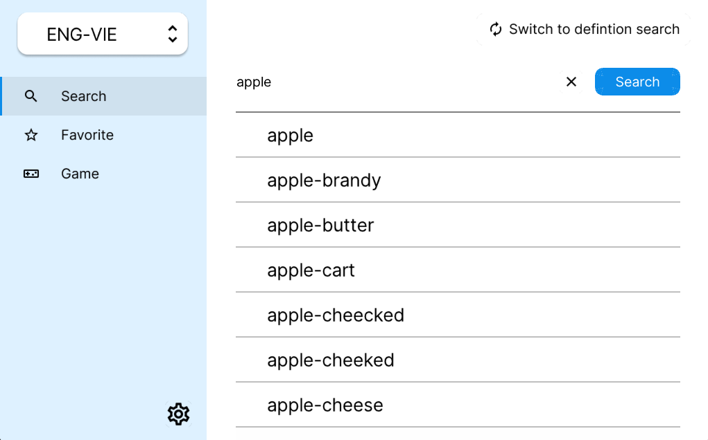

# CS163 - Dictionary

## Description
This project implements a dictionary using a Trie data structure in C++. The dictionary supports multiple languages including Eng-Eng, Eng-Vie, Vie-Eng, slang, and even emojis. It utilizes the raylib library for its graphical interface.

## Features
* **Multiple Languages:** Supports various language dictionaries.
* **Search Functionality:** Allows users to search by keyword or definition.
* **Search History:** Keeps track of previous searches.
* **Add and Remove Words:** Users can contribute to the dictionary.
* **Favorites:** Mark words as favorites for quick access.
* **Word Quizzes:** Engage in quizzes to test vocabulary.

## Dependencies
* [raylib](https://www.raylib.com/): External library used for graphical interface.
